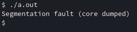
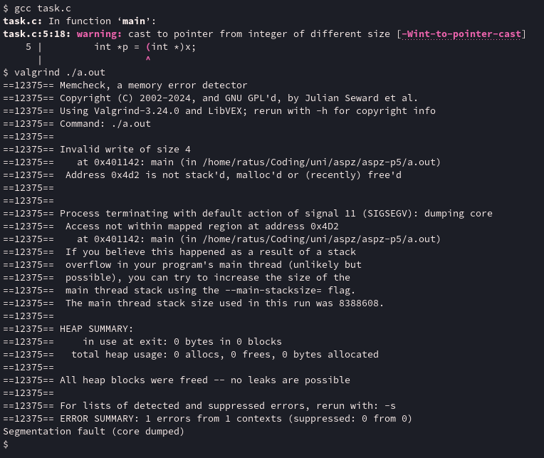

# aspz-p5

## Завдання по варіанту - №3

Змоделюйте ситуацію, коли одна й та сама змінна випадково використовується як покажчик, хоча ним не є — і що з цього випливає.

## Виконання завдання

Спершу, написав наступню програму яка задовольняє умови задачі: [task.c](./task.c)

```c
#include <stdio.h>

int main() {
	int x = 1234;
	int *p = (int *)x;
    
	*p = 42;
	printf("*p = %d\n", *p);
    
	return 0;
}
```

Оголошуємо змінну ```x``` як ```int```, зі значенням ```1234```.

Потім присвоєму вказівнику ```(int *)x```. Так як x це не вказівник, то його значення буде конвертоване в адресу - ```0x4d2```.

Відповідно, коли ми пробуємо присвоїти до ```p``` значення 42, а адреса ```p``` це ```0x4d2``` - яка не була виділена. Відповідно, це невизначена поведінка (Undefined behavior, UB). Давайте поглянемо, що дасть простий запуск програми:



Core dumped.

Давайте подивимося детальніше, що відбувається, за допомогою valgrind:



Як бачимо, відбувається те, про що я згадав - невизначена поведінка, а саме, ми пробуємо записати дані на адресу пам'яті яка не була виділена для нашого процесу.

```
==15819== Process terminating with default action of signal 11 (SIGSEGV): dumping core
==15819==  Access not within mapped region at address 0x4D2
==15819==    at 0x401142: main (in /home/ratus/Coding/uni/aspz/aspz-p5/a.out)
==15819==  If you believe this happened as a result of a stack
==15819==  overflow in your program's main thread (unlikely but
==15819==  possible), you can try to increase the size of the
==15819==  main thread stack using the --main-stacksize= flag.
==15819==  The main thread stack size used in this run was 8388608
```